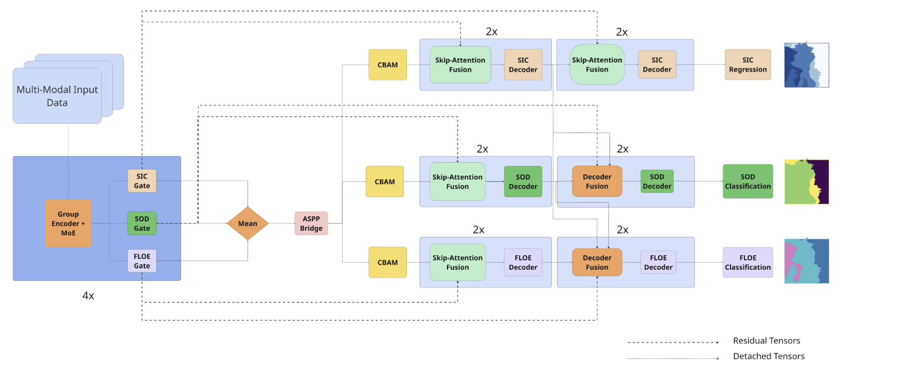
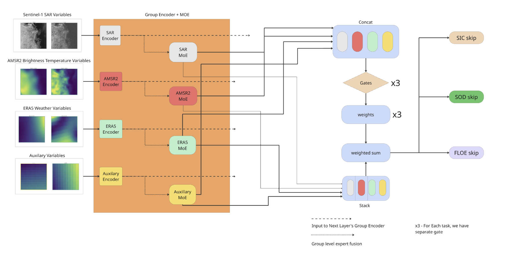

# Ice-MoE

### Towards Auto Sea-Ice Charting Using Multi-Modal Data Fusion and Mixture of Experts


<!--  -->

<!-- ---

<p align="center">
  
</p>

--- -->

## Overview

Accurate charting of Arctic sea ice is essential for climate monitoring, operational forecasting, marine navigation, and supporting communities that rely on ice-covered waters. Traditional chart generation relies on expert interpretation of multiple satellite products — a process that is labor-intensive, time-consuming, and difficult to scale.

SeaIce-MoE moves beyond conventional U-Net approaches that treat all sensor inputs as a single homogeneous tensor. Instead, it learns specialized representations for each sensor modality before fusing them in a structured, task-aware manner.

**Links:** [Architecture](#architecture) · [Installation](#installation) · [Training](#training) · [Evaluation](#evaluation) · [Results](#results) · [Citation](#citation)

---

<!-- ## Key Contributions

**Sensor-specific expert encoders** — each satellite modality (SAR, PMW, ENV, AUX) passes through its own dedicated encoder, preserving modality-specific characteristics rather than collapsing all inputs early.

**Modality-aware MoE fusion** — a Mixture-of-Experts fusion layer combines the per-modality representations, learning which experts to weight for each spatial location and input combination.

**Decoder-level task interactions** — task-specific decoders exchange information through controlled feature-sharing mechanisms, improving prediction consistency across sea ice variables.

--- -->

## Architecture
The overview of the full model : 
<!--  -->
<p align="center">
  
</p>

A closer look at the encoder

<p align="center">
  
</p>


---
<!-- 
## Repository Structure

```
SeaIce-MoE/
├── configs/
│   ├── model/
│   ├── training/
│   └── dataset/
├── datasets/
│   ├── loaders/
│   ├── transforms/
│   └── preprocessing/
├── models/
│   ├── encoders/
│   ├── decoders/
│   ├── fusion/
│   ├── moe/
│   └── losses/
├── training/
├── evaluation/
├── scripts/
├── checkpoints/
├── assets/
├── train.py
├── evaluate.py
└── predict.py
```

--- -->

## Installation

```bash
git clone https://github.com/psvkaushik/SeaIce-MoE.git
cd Sea_Ice_MoE

conda create -n seaice python=3.11
conda activate seaice-moe

pip install -r requirements.txt
```

---

## Dataset

Experiments are conducted on the **AutoIce Challenge Dataset**[link](https://data.dtu.dk/articles/dataset/Ready-To-Train_AI4Arctic_Sea_Ice_Challenge_Dataset/21316608?backTo=/collections/AI4Arctic_Sea_Ice_Challenge_Dataset/6244065).

Download the data from the above mentioned link and place them in the data folder in the following expected layout:

```
data/
├── train/
├── test/
```

### Sensor Modalities

| Code | Modality               | Description                              |
|------|------------------------|------------------------------------------|
| SAR  | Synthetic Aperture Radar | Primary high-resolution backscatter     |
| PMW  | Passive Microwave      | Brightness temperature, coarser spatial  |
| ENV  | Environmental Variables | Temperature, wind, atmospheric reanalysis |
| AUX  | Auxiliary Inputs       | Additional supporting satellite data     |

---

## Training and Evaluation

**Single GPU**

```bash
python train_cl.py config_cl.py --wandb-project "PROJECTNAME" --work-dir /path_to/src/log_dir --seed 42
```


A single file([credits](https://github.com/echonax07/MMSeaIce/tree/main)), performs the training, and generates the prediction charts on the test data.

The model checkpoints and the generated charts are stored in `src/log_dir`

---
## Results

### Benchmark
| Architecture | SIC-R²↑ | SOD-F1↑ | FLOE-F1↑ | Combined Score↑ |
|---|---|---|---|---|
| SAR-IceFM | 74.8 | 72.5 | 63.4 | 71.6 |
| Unet | 86.61 | 86.19 | 72.65 | 83.65 |
| PoolFormer | 87.36 | 82.96 | 71.31 | 82.39 |
| AutoIce-4th | 87.22 | 77.52 | 73.59 | 80.61 |
| AutoIce-3rd | 85.35 | 80.26 | 74.66 | 81.17 |
| Spectral-Comparison | 87.03 | 86.26 | 73.09 | 83.93 |
| MFGC-Net | 86.3 | 86.42 | 75.22 | 84.13 |
| GLFFuse | 87.5 | 87.74 | 74.8 | 84.94 |
| MMSeaIce (Sep-Decoder) | 91.7 | 88.2 | 76.4 | 87.3 |
| MMSeaIce ᵋ (Common-Decoder) | 91.24 | 88.21 | 73.52 | 86.48 |
| DBMT | 89.95 | 90.03 | 77.69 | 87.53 |
| **Ice-MoE ᵠ** | **91.85** | **91.46** | **78.01** | **88.94** |

> ᵠ Our model.  
> ᵋ Our best replication of the method using the author's code.

### Seasonal 
| Architecture | Winter SIC-R²↑ | Winter SOD-F1↑ | Winter FLOE-F1↑ | Autumn SIC-R²↑ | Autumn SOD-F1↑ | Autumn FLOE-F1↑ | Spring SIC-R²↑ | Spring SOD-F1↑ | Spring FLOE-F1↑ | Summer SIC-R²↑ | Summer SOD-F1↑ | Summer FLOE-F1↑ |
|---|---|---|---|---|---|---|---|---|---|---|---|---|
| MMSeaIce (Common-Decoder) | 95.52 | 73.71 | **59.11** | 86.64 | 84.07 | 78.50 | 93.25 | 87.99 | 81.39 | 84.69 | **96.42** | 69.27 |
| **Ice-MoE ᵠ** | **95.52** | **87.07** | 57.85 | **87.99** | **88.35** | **79.17** | **94.02** | **90.02** | **85.93** | **85.82** | 96.07 | **78.82** |
| Δ (Ice-MoE − MMSeaIce) | +0.00 | +13.36 🟢 | −1.26 🔴 | +1.35 🟢 | +4.28 🟢 | +0.67 🟢 | +0.77 🟢 | +2.03 🟢 | +4.54 🟢 | +1.13 🟢 | −0.35 🔴 | +9.55 🟢 |

> ᵠ Our model.
### Qualitative

<p align="center">
  
</p>

<!-- ---

## Ablation Studies

### Modality-specific encoders

| Configuration   | Score |
|-----------------|-------|
| Shared encoder  | —     |
| Expert encoders | —     |

### Fusion strategy

| Configuration    | Score |
|------------------|-------|
| Concatenation    | —     |
| Attention fusion | —     |
| MoE fusion       | —     |

### Decoder interactions

| Configuration        | Score |
|----------------------|-------|
| Independent decoders | —     |
| Decoder interactions | —     |

---

## Model Zoo

| Model            | Description | Download |
|------------------|-------------|----------|
| SeaIce-MoE Base  | —           | —        |
| SeaIce-MoE Large | —           | —        | -->

---

## Reproducing Paper Results

<!-- ```bash
# Train
python train.py \
    --config configs/paper/main.yaml

# Evaluate
python evaluate.py \
    --config configs/paper/main.yaml \
    --checkpoint checkpoints/paper.ckpt -->
<!-- ``` -->
We are working on a standalone evaluate script, but do contact us if you want to use our weights!
---

## Applications

- Operational sea ice chart generation
- Arctic climate monitoring
- Maritime route planning and polar navigation


---

## Citation

```bibtex
@article{kp_rv_2026seaicemoe,
  title   = {Towards Auto Sea-Ice Charting Using Multi-Modal Data Fusion},
  author  = {Pillalamarri and Vatsavai},
  conference = {TODO},
  year    = {2026}
}
```

---

## Acknowledgements

We thank the AutoIce Challenge organizers for open data, MMSeaIce authors for open code, North Carolina State University and the Computer Science Department for Compute.

---

## Contact

**Kaushik Pillalamarri** · spillal2@ncsu.edu 
 <!-- · [Project Page](#) · [Paper](#) -->

---
<p align="center"><i>If this work interests you, please don't hesistate to reach out for collaborations.</i></p>
<!-- <p align="center"><i>If this work helps your research, please consider starring the repository.</i></p> -->